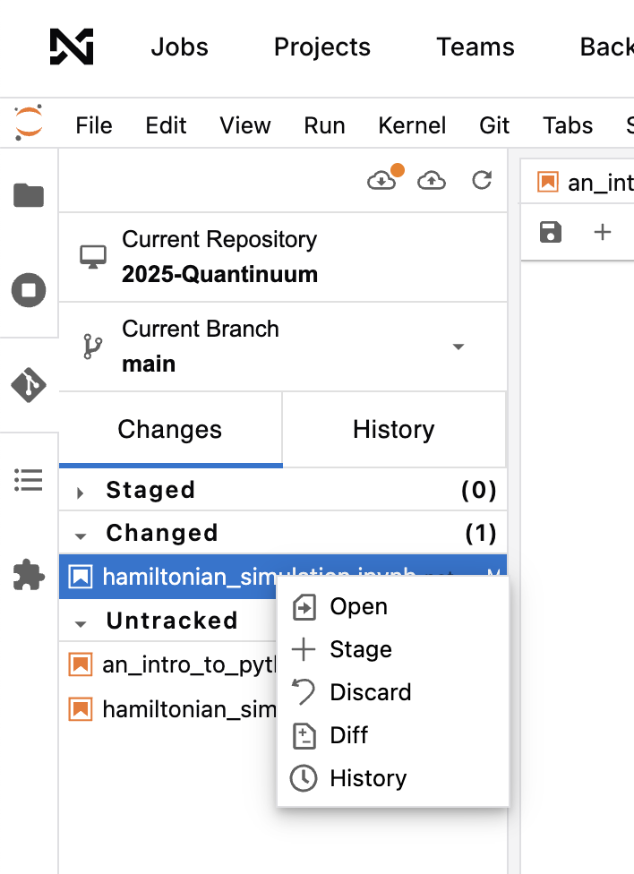
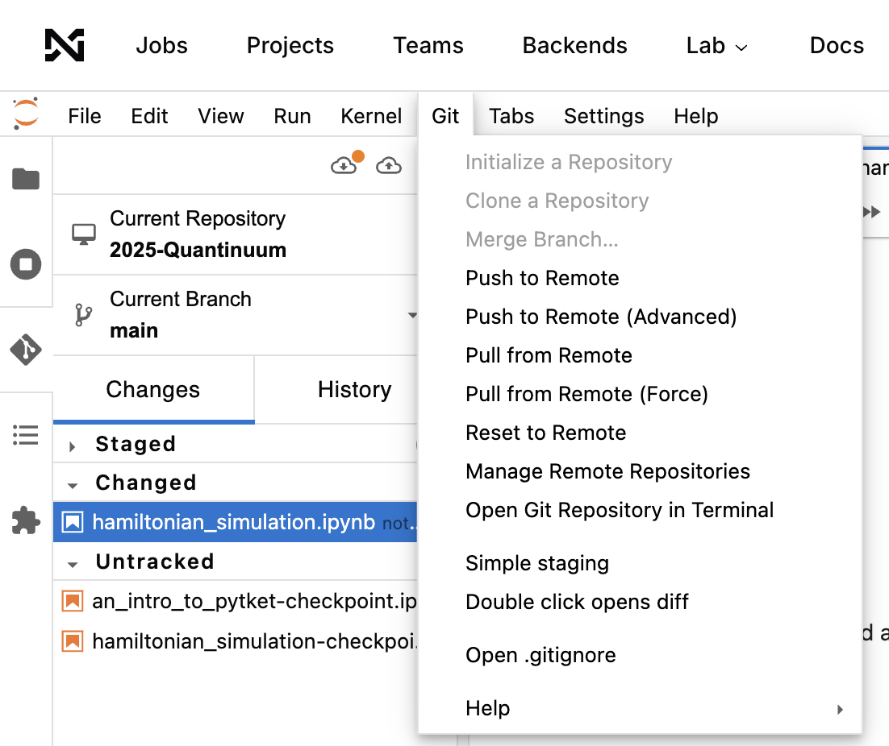

# Quantinuum Challenge: Hamiltonian and Lindbladian simulation

In the Quantinuum iQuHack 2025 challenge we explore ways to simulate physical quantum systems on a digital quantum computer. Quantum system simulation has a huge relevance for applications, for example in quantum chemistry and the molecular sciences.
Typically, simulating quantum systems on classical computers is extremely challenging, and many approximations and simplifications are required. Quantum computers might offer a unique route to accurately simulate large-scale quantum systems and to advance our understanding of the physical world and push the boundaries of computational methods for the natural sciences. Moreover, quantum system simulation is expected to be one of the first applications for quantum computers showing a genuine advantage over classical computational methods. This is because we can translate a quantum system much more directly to a gate sequence on a quantum computer than, for example, an abstract classical optimization problem.

#### Hamiltonian simulation
A closed quantum system, such as a chain of spins, is described by a Hamiltonian operator $H$, which generates a unitary time evolution of the system state. In the first part of this challenge, we study the simulation of such unitary dynamics on a digital quantum computer. As a use-case we consider prototypical spin model, such as the Ising and Heisenberg models, that describe magnetic systems. In this challenge you will learn how unitary dynamics is "Trotterized" as a quantum circuit, and how algorithmic parameters such as the Trotterization step size influence the accuracy of the algorithm. Moreover, we will dive into circuit optimization techniques and how hardware noise influences the computation.

#### Lindbladian simulation
Most quantum systems in nature are not closed, i.e. perfectly isolated from the environment. Often, in real scenarios, the quantum system in coupled in some way to the environment. These systems are called open (or dissipative) quantum systems. In such cases, information about the system state is continuously lost and transferred to the environment, where this information cannot be accessed anymore. Open quantum systems, in the most prototypical case, are described by a Lindbladian operator, which can be seen as a generalization of the Hamiltonian operator, and which generates the open system dynamics similar to how the Hamiltonian generates the closed system dynamics.
As information and energy is continuously "dissipated" into the environment, these systems are also called "dissipative systems". Because of this, the time evolution is not unitary anymore (as information is lost to the environment), so its implementation on a quantum computer will require the introduction of "ancilla qubits" which are discarded at some point in the computation.

## Useful links
- All pytket documentation -> https://docs.quantinuum.com/tket/
- Nexus documentation -> https://nexus.quantinuum.com/

## Challenge

Below we describe the two parts of the Quantinuum iQuHack 2025 challenge. For each part there is a dedicated notebook in the notebooks folder. In each notebook we outline several potential tasks which can guide you through the challenge. The list of tasks is pretty long, so we don't expect you to address all tasks. Some of them are fairly open, and most tasks are quite separate, so you can work on them in parallel. Pick the tasks which you find most interesting. You might as well get creative and explore other routes and ideas (including also classical simulation techniques) in the context of Hamiltonian and Lindbladian simulation that are not mentioned in the notebooks. The challenge will not mainly be judged on how many tasks you solve, but also on points such as

- Creativity, ingenuity
- Coding and implementation skills
- Physical insight
- Supporting claims with data
- Relevance of the results
- Quality of presentation
- Clear explanation of results
- Statement of the used methods and tools
- It should be somehow related to circuit simulations of quantum systems.

## When you are ready to begin

* One member of the team should fork this repository and share the URL with team members. 
* When the challenge begins you will get an email inviting you to set up an account on the Quantinuum Nexus website.
* Follow the instructions on the invite email and visit [https://nexus.quantinuum.com](https://nexus.quantinuum.com). 
* Once you've logged in, click on the burger menu in the top left corner and select 'Lab'.
* Select 'Start' to boot up your hosted workspace.
* Once in the workspace, click on the Git icon in the left-most panel and clone your team's forked repo using the URL from above. Git cloning using https is recommended here. You will need to set up a github [classic token](https://docs.github.com/en/authentication/keeping-your-account-and-data-secure/managing-your-personal-access-tokens#creating-a-personal-access-token-classic) which you should store securely on your device (make sure to grant write permissions for the repository). If you need help with this, please ask.
* When you are ready to submit your project, send a link to your fork of this repository in the Quantinuum challenge discord server before the time limit.
* If you would like to test out nexus try running the example on [noiseless simulation](https://github.com/iQuHACK/2025-Quantinuum/blob/main/notebooks/an_intro_to_quantinuum_nexus.ipynb) and also using the [noisy emulator ](https://github.com/iQuHACK/2025-Quantinuum/blob/main/notebooks/an_intro_to_quantinuum_nexus_part2.ipynb).  

## Pushing to GitHub from Nexus
* On the left panel click the GitHub icon

* Write click on the file and select stage
* Write and commit message and click `commit`
* Click on the Git tab and select `Push to Remote`, then enter your GitHub `username` and `personal access token`

## Hamiltonian simulation

This part of the challenge is described in more detail in `notebooks/hamiltonian_simulation.ipynb`. In this part, you will explore Hamiltonian simulation, i.e. the simulating the time evolution of a closed quantum system described by a Hamiltonian. Among others, you will see some basic example Hamiltonians and you will have the opportunity to combine several important techniques to implement the corresponding time evolution as a quantum circuit.

In this part of the challenge you can explore, among others,
- Implementation of quantum Hamiltonians, with commuting and non-commuting terms
- Implement Trotterization circuits for time evolution and study Trotter error scaling
- Analyze trade-offs between Trotterization errors and hardware noise, by using Quantinuum's emulators including realistic hardware noise models
- Explore classical simulation techniques (e.g. with `numpy`) to test and benchmark quantum circuit results
- Circuit resource estimates (mainly two-qubit gate count) as function of Trotter step, and how this influences hardware noise
- Explore physically interesting scenarios for time evolution, such as energy conservation, time-dependent expectation values, spectral decomposition of the Hamiltonian

Useful literature:
- A. Montanaro, Quantum Computation, Lecture notes, Chapter 7, https://people.maths.bris.ac.uk/~csxam/teaching/qc2020/lecturenotes.pdf 
- T. Prosen, "Exact nonequilibrium steady state of a strongly driven open XXZ chain", arXiv:1106.2978, https://arxiv.org/abs/1106.2978 (2011)
- A. M. Childs et al., "A Theory of Trotter Error", https://arxiv.org/abs/1912.08854 (2021)
- Qiskit Docs, https://docs.quantum.ibm.com/api/qiskit/qiskit.synthesis.SuzukiTrotter
- Quantinuum Docs, https://docs.quantinuum.com/h-series/trainings/getting_started/pytket_quantinuum/Quantinuum_native_gate_compilation.html

## Lindblad simulation

This part of the Quantinuum challenge is described in detail in `notebooks/lindbladian_simulation.ipynb`.
It is about the dynamics of open quantum systems (also called dissipative quantum systems), i.e. quantum systems that are not isolated by coupled to an environment. While closed systems are described by a Hamilton operator, open systems are described by a Lindblad operator. The Lindblad operator contains, in addition to a Hamiltonian part, so-called jump operator terms, which describe the interaction with the environment. In the notebook `notebooks/lindbladian_simulation.ipynb` you will find a short introduction to open system dynamics, Lindbladians and a detailed description how to implement such dynamics as a quantum circuit.

In this part of the challenge you will be able to explore, among other things,
- Lindbladians, jump operators and open system dynamics
- Implementation of Lindblad dynamics, as an extension of the Hamiltonian dynamics from the first part of the challenge, with quantum circuits
- Randomized and deterministic versions of the Lindblad simulation algorithm.
- Generate spin profile results from FIG.2. of [1]
- Comparing Lindblad and Hamiltonian system dynamics in the long-time limit
- Trotter step error analysis of the Lindblad simulation circuit
- Circuit resource estimates and influence of hardware noise models

Useful literature:
- T. Prosen, "Exact nonequilibrium steady state of a strongly driven open XXZ chain", arXiv:1106.2978, https://arxiv.org/abs/1106.2978 (2011)
- R. Cleve, C. Wang, "Efficient Quantum Algorithms for Simulating Lindblad Evolution", arXiv:1612.09512, https://arxiv.org/abs/1612.09512 (2016)
- H. Chen et al., "A Randomized Method for Simulating Lindblad Equations and Thermal State Preparation", arXiv:2407.06594v2, https://arxiv.org/abs/2407.06594v2 (2024)
- Z. Ding et al. "Simulating Open Quantum Systems Using Hamiltonian Simulations", arXiv:2311.15533, https://arxiv.org/abs/2311.15533 (2023)
- Brunner et al. "Lindblad engineering for quantum Gibbs state preparation under the eigenstate thermalization hypothesis", arXiv:2412.17706, https://arxiv.org/abs/2412.17706 (2024)
- T. Prosen, I. Pizorn, "Quantum phase transition in a far from equilibrium steady state of XY spin chain", arXiv:0805.2878, https://arxiv.org/abs/0805.2878 (2008)
- J. Jin et al., "Cluster mean-field approach to the steady-state phase diagram of dissipative spin systems", arXiv:1602.06553, https://arxiv.org/abs/1602.06553 (2016)
